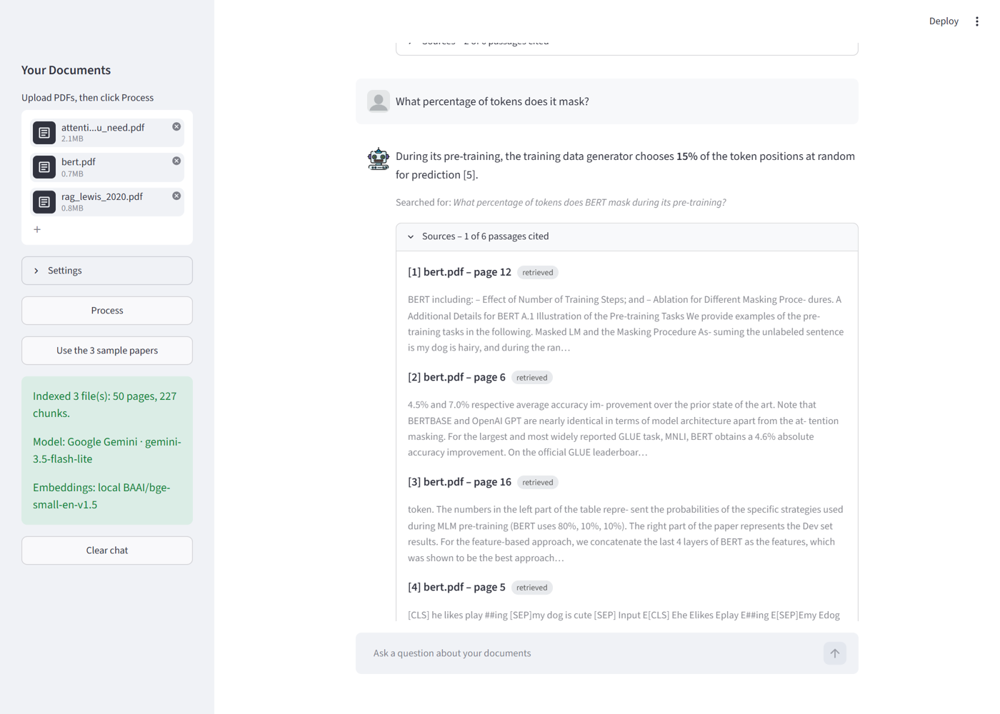
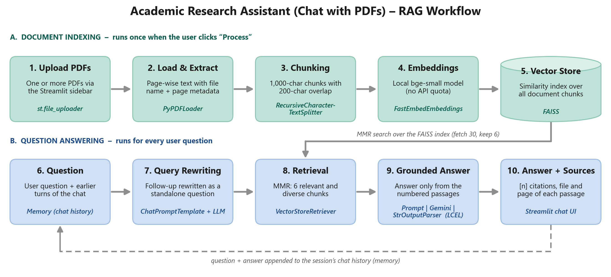

# 📄 Chat with PDFs: an Academic Research Assistant

A Streamlit app for asking questions about research papers, lecture notes or textbook chapters.
Upload one or more PDFs and ask in plain English. The app finds the most relevant passages and an LLM
answers **only from those passages**, citing them as `[1]`, `[2]`, … with the file name and page number.
It remembers the conversation, so follow-ups like *"how many of them does it use?"* work.

Built with LangChain for the GAI Lab 9 PSIS activity (Activity 1: RAG-based domain assistant) by
**Shahaan Bharucha (I007)** and **Nishtha Bavishi (I005)**.



---

## Architecture



**Indexing** (once, when you click *Process*): PDFs are read page by page, split into overlapping chunks,
embedded with a local model and stored in a FAISS index.
**Question answering** (every question): a follow-up is first rewritten into a standalone question using the
chat history, the retriever picks 6 relevant and diverse chunks (MMR), and the LLM answers from those numbered
passages only. Question and answer are then added to the chat history.

| LangChain component | Where | What it does |
|---|---|---|
| `PyPDFLoader` (document loader) | `rag/ingest.py` | One `Document` per page, with file name and page number metadata |
| `RecursiveCharacterTextSplitter` | `rag/ingest.py` | 1,000-character chunks, 200 overlap; page metadata copied to every chunk |
| `FastEmbedEmbeddings` + `FAISS` | `rag/ingest.py`, `rag/providers.py` | Local `BAAI/bge-small-en-v1.5` embeddings in a FAISS index |
| `VectorStoreRetriever` (MMR) | `rag/ingest.py` | Fetches the 30 closest chunks and keeps 6 that are relevant but not near-duplicates |
| `ChatPromptTemplate` + `MessagesPlaceholder` | `rag/chain.py` | Query-rewriting prompt and grounded-answer prompt (with "say you could not find it" rule) |
| LCEL composition (`RunnablePassthrough`, `RunnableBranch`, `\|`) | `rag/chain.py` | rewrite → retrieve → answer pipeline; rewriting is skipped on the first turn |
| `ChatGoogleGenerativeAI` / `ChatOpenAI` | `rag/providers.py` | Gemini `gemini-3.5-flash-lite` by default, OpenAI selectable |
| `StrOutputParser`, `PydanticOutputParser` | `rag/chain.py`, `evaluate.py` | Plain-text answers; structured grounding verdicts from the LLM judge |
| Memory: `RunnableWithMessageHistory` + `InMemoryChatMessageHistory` | `rag/chain.py`, `app.py` | Per-session chat history fed back into both prompts (last 10 messages) |
| `with_fallbacks` | `evaluate.py` | Judge uses a stronger Gemini model and falls back to the chat model when it is overloaded |

## Run it

### In GitHub Codespaces (recommended)
1. Add `GOOGLE_API_KEY` (free key from [Google AI Studio](https://aistudio.google.com/apikey)) as a Codespaces
   secret for this repository. `OPENAI_API_KEY` is optional.
2. *Code → Codespaces → Create codespace on main*. The dev container installs the requirements and downloads
   the three sample papers.
3. Run `streamlit run app.py` and open the forwarded port 8501.

### Locally
```bash
git clone https://github.com/Shahaanb/PDF-Chats.git
cd PDF-Chats
python -m venv .venv
.venv\Scripts\activate          # macOS/Linux: source .venv/bin/activate
pip install -r requirements.txt
copy .env.example .env          # macOS/Linux: cp .env.example .env, then add your key
python sample_docs/download_samples.py
streamlit run app.py
```

### Using the app
1. Upload PDFs in the sidebar and click **Process**, or click **Use the 3 sample papers**.
2. Ask questions in the chat box. Expand **Sources** under an answer to see the retrieved passages; the ones
   the answer cites are tagged *cited*.
3. *Settings* lets you switch provider, the number of passages (k) and the search type (MMR or similarity).
   **Clear chat** starts a new conversation.

The first **Process** downloads the embedding model (about 65 MB) once; indexing the three sample papers
(50 pages, 227 chunks) takes about 70 s on a 2-core Codespace.

## Configuration

| Variable | Default | Purpose |
|---|---|---|
| `GOOGLE_API_KEY` / `OPENAI_API_KEY` | – | At least one is required |
| `LLM_PROVIDER` | `google` if its key is set | `google` or `openai` |
| `GOOGLE_CHAT_MODEL` | `gemini-3.5-flash-lite` | Gemini chat model |
| `OPENAI_CHAT_MODEL` | `gpt-4o-mini` | OpenAI chat model |
| `EMBEDDINGS` | `local` | `provider` uses the provider's embedding API instead of the local model |
| `LOCAL_EMBEDDING_MODEL` | `BAAI/bge-small-en-v1.5` | Any FastEmbed text model |

## Evaluation

`eval/questions.json` holds 11 test questions over the three sample papers (*Attention Is All You Need*,
*BERT*, and *Retrieval-Augmented Generation*): factual lookups, a numeric value, a concept explanation, two
memory follow-ups, a comparison, a cross-document question, a table value and an out-of-scope question.
Each has the expected answer, the key facts it must contain and the pages it should come from.

```bash
python evaluate.py                                          # final configuration
python evaluate.py --baseline --out eval/results_baseline   # first version, for comparison
```

| Configuration | Correct | Retrieval hit@k | Cites a source | Grounded (LLM judge) |
|---|---|---|---|---|
| Baseline: similarity search, k = 4, answer step sees the raw follow-up | 7 / 11 | 9 / 10 | 7 / 10 | 9 / 11 |
| **Final: MMR, k = 6, answer step sees the rewritten question** | **10 / 11** | **9 / 10** | **9 / 10** | **11 / 11** |

Full answers, retrieved pages and judge explanations: [final](eval/results/results.md),
[baseline](eval/results_baseline/results.md) and our [first baseline run](eval/results_baseline_run1/results.md)
(6 / 11 correct; the chat model judged itself).

What the evaluation showed:
* **Follow-ups (Q4, Q6) failed in the baseline.** Q4 retrieved the right page, but the answer step only saw
  *"How many of them…"* and replied that it could not find it. Q6 missed the one chunk that says *15%*,
  which ranked 6th. Passing the rewritten question to the answer step fixed Q4; retrieving 6 chunks with
  MMR instead of 4 fixed Q6, and the extra passages also let Q8 name DPR and BART.
* **Cross-document question (Q9) still fails.** *"Which of these papers uses BERT inside its own
  architecture?"* retrieves six chunks from the BERT paper because the query says "BERT"; the answer is in the
  RAG paper ("BERT-base document encoder"), and that chunk is not in the top 30 by similarity, so no k or
  search type fixes it. The assistant says it cannot find the answer rather than guessing.
* **MMR is a trade-off.** The automatic check counts Q5 as correct in the final run, but reading it, the
  answer is only partly right: it names Mask LM and NSP but first says the tasks are "not fully detailed",
  because MMR swapped out the page 4 chunk that similarity search had found. By our own reading the final run
  has 9 fully correct answers, 1 partly correct (Q5) and 1 wrong (Q9).
* **Tables are fragile.** PDF extraction flattens Table 2's `2.3 · 10^19` to `2.3· 1019`. The model read it
  correctly in the last two runs but not in our first run.
* Gemini output is not fully deterministic, so a question can flip between runs; the results above are single
  runs.

### Unit tests
```bash
pytest
```
15 offline tests with fake LLMs and a fake retriever (no API key needed): page metadata, chunking, citations,
query rewriting, memory and the retriever settings.

## Project structure
```
app.py                  Streamlit UI (upload, settings, chat, sources)
Templates.py            avatars and CSS
rag/ingest.py           PDF loading, chunking, FAISS index, retriever
rag/chain.py            prompts and the LCEL chain with memory
rag/providers.py        Gemini / OpenAI chat models and embeddings
evaluate.py             evaluation script (LLM judge with PydanticOutputParser)
eval/                   test questions and results
tests/                  offline unit tests
sample_docs/            script that downloads the sample papers from arXiv
docs/                   architecture diagram and screenshots
.devcontainer/          GitHub Codespaces setup
```

## Limitations and future work
* **Cross-document and "which paper" questions:** retrieval is per chunk, so a question naming one paper pulls
  only that paper. Per-document retrieval, query decomposition or hybrid keyword + vector search (BM25) would help.
* **Tables, equations and figures** lose their structure in text extraction. A layout-aware parser
  (e.g. table extraction to Markdown) is the fix.
* **Scanned PDFs** have no extractable text; OCR is not implemented.
* The index lives in memory and is rebuilt for every upload; persisting the FAISS index would make reloads instant.
* The LLM judge is itself a model and can be wrong; we read every verdict and noted disagreements in the report.
* LangChain 1.6 marks `RunnableWithMessageHistory` as deprecated in favour of LangGraph persistence. It works
  with the pinned versions, and migrating is listed as future work.
